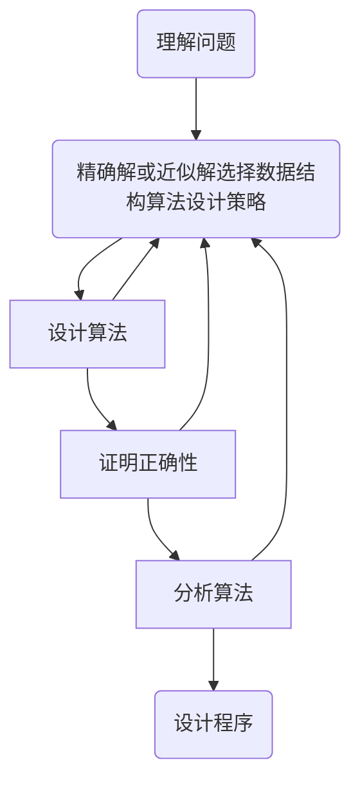

# 01_数据结构绪论
* ### *学习内容*
>* #### 常用术语
>* #### 集合、线性结构、树、图的表示
>* #### 算法评价
>* #### 时间与空间复杂度

## 1 讨论范畴
​		**数据结构**是一门研究**非数值计算的程序设计问题**中计算机的**操作对象**以及**它们之间的关系和操作等**的学科。具体而言，研究数据的**逻辑结构**和**物理结构**的相互关系，并对这种结构进行**相应运算**。
### 1.1 程序 = 数据结构 + 算法
>* #### 程序 -> 指令集
>* #### 数据结构 -> 数学模型
>* #### 算法 -> 问题处理策略

### 1.2 数值计算问题与非数值计算问题
数据结构早期用于解决**数值计算**问题，后来用于解决**非数值计算**问题
#### 1.2.1 数值计算问题
1. 过程：**提出数学模型** -> **选择程序语言** -> **编写程序** -> **测试** -> **最终解答**
2. 关键：如何**得出数学模型**
#### 1.2.2 非数值计算问题
数据元素之间的相互关系**一般无法用数学方程描述**。
##### 例如:
1. 田径赛队员的时间安排问题
2. 排课问题
3. 多叉路口交通灯管理问题
4. 旅行商问题
#### 1.2.3 求解非数值计算问题
1. 对所加工对象进行**逻辑组织**；
2. 将加工对象**存储**到计算机内存；
3. 进行**数据运算**。
### 1.3 学科地位
介于**数学**、**计算机硬件**、**计算机软件**之间的一门核心课程。
## 2 相关概念
### 2.1  基本概念和术语
* **Data（数据）**
描述客观事物的数字、字符以及一切能够输入到计算机中，并且能够被计算机程序处理的**符号的集合**。
* **Data Node（数据元素）**
**数据的基本单位**，数据这个集合中的一个一个元素。
* **Data Item（数据项）**
数据结构中讨论的**最小单位**，数据元素可以是数据项的集合。
* **Key（关键码）**
**唯一标识作用**的数据项。
* **Relation（关系）**
数据元素之间的某种**相关性**。
### 2.2 数据结构相关概念
#### 2.2.1 数据结构的定义
若在相同特性的数据元素集合的元素之间存在一种或多种**特定的关系**，则该数据元素的集合称为一种数据结构。
*  数据元素（Data Node）是带结构的。
*  结构指的就是数据元素之间存在的关系。
#### 2.2.2 层次分类
##### 数据逻辑结构
数据元素之间存在的**逻辑关系**的一种抽象描述，可以用一个**数据元素的集合**和定义在此**集合上的若干关系**来表示。
###### 逻辑结构的形式定义
* 数据结构是一个二元组
> Data_Structure = (D, S)
>> D -> 数据元素的**有限集合**
>> S -> D上的**若干关系**

* 不同的关系构成不同的结构
  * **集合（Collection）** -> 除了同属一个集合外，无其他关系
  * **线性结构（Line Arity）** -> 一对一关系，如线性表、栈、队列
  * **树形结构（Tree）** -> 一对多关系
  * **图状结构（Graph）** -> 多对多关系
##### 数据物理结构
数据的逻辑结构在计算机中的表示或实现，故又可称为**存储结构**。
###### 存储结构的形式定义
* **顺序存储结构**
数据元素**在存储器中的相对位置**表示数据**元素之间的逻辑关系**
* **链式存储结构**
每个元素（Node）中加一个存放地址的**指针**，用此指针来表示数据元素之间的逻辑关系
##### 数据结构主要内容
1. 逻辑结构（数据元素间客观联系）
	* **线性结构**
		* 线性表
		* 栈
		* 队列
		* 串及数组
	* **非线性结构**
		* 树
		* 图
2. 物理结构（某种逻辑关系的数据的内存存储方式）
	* **顺序存储**
	* **链式存储**
	* **索引存储**
	* **散列存储**
3. 算法（在各种数据结构的基础上进行一系列有效的基本操作）
	* **检索**、**排序**、**插入**、**删除**、**修改**
#### 2.2.3 抽象数据类型
> **抽象数据类型 = 数据结构 + 操作**
> **ADT = (D, S, P)**
>> D -> 数据对象
>> S -> 关系集合
>> P -> 对数据对象的**基本操作**

## 3. 算法及其描述和分析
### 3.1 算法的定义
> 对问题求解过程的一种描述，是为解决一个或一类问题给出的一个**确定的、有限长的操作序列**。

### 3.2 算法的性质
#### 1. 有穷性
> 执行**有穷步骤**之后一定能结束，每个步骤都能在**有限时间**内完成。

#### 2. 确定性
> 1. 每种可能的操作,在算法中都有**确定的规定**，使执行者和阅读者都能明确含义，及如何执行。
> 2. 任何条件下，算法都只有**一条执行路径**。
> 3. 输入与输入的确定关系即为**算法的功能**。

#### 3. 可行性
> 所有操作都足够基本，可通过已实现的基本操作**有限次**实现它。
#### 4. 有输入
> 加工对象的量值，体现为算法中的**一组变量**。
#### 5. 有输出
> 一组与**输入**有关的量值，算法进行信息加工后得到的结果。

### 3.3 算法的设计过程
#### 算法设计过程流程图

### 3.4 算法的描述
  #### 1. 自然语言
  #### 2. 程序流程图
  #### 3. 某种具体计算机语言
  #### 4. 类计算机语言的伪代码
### 3.5 算法效率的衡量方法和准则
#### 1. 衡量方向（除了正确性外）
* 时间复杂度
* 空间复杂度
* 其他方面
	* 可读性、可移植性、易测试性
#### 2. 时空相互制约
**解同一个问题，不同的算法，计算的工作量不同，计算时间也随之不同，即是复杂性**
> 时间和空间哪个更重要，参考具体情况。
> 算法的高效与易理解、易编程之间也有制约关系。
综合使用频度等方面考虑。

#### 3. 时间复杂度
在计算机中运行时间的主要影响因素
*  **问题规模**
*  **编程语言**
* **程序编译的强弱**、**产生机器代码的优劣**。
* 机器**执行一条指令的时间长短**。
##### 3.1 频度统计法
**语句执行次数的多少作为时间量度的算法分析方法**
* 常见的时间复杂度 
  * 常数阶 -> **O(1)**
  * 对数阶 -> **O($\log_{2}{n}$)**
  * 线性阶 -> **O(n)**
  * 线性对数阶 -> **O(n$\log_{2}{n}$)**
  * 平方阶 -> **O($n^2$)**
  * 立方阶 -> **O($n^3$)**
  ...
  * k次方阶 -> **O($n^k$)**
  * 指数阶 -> **O($2^n$)**
#### 4. 空间复杂度
  1. **输入数据**所占存储空间
  2. **程序本身**所占用的存储空间
  3. 算法运行过程**临时占用**的存储空间
算法**运行过程占用存储空间大小**被定义为**空间复杂性。**
	* **局部变量**所占用的存储空间
	* 系统为了递归所使用的**堆栈的存储空间**。