# 04_一对多存储结构小结

## 二叉树概述


二叉树由一个**根节点**加上两个**互不相交**的**左右子树**构成，或者是一个没有结点的空树。

* 每个结点最多有两个子结点。
* 左子树和右子树不可互换，是有序的。

例如，结点A 为根节点，以结点B 为根节点的子树为左子树，以结点C为根节点的子树称为右子树。

>  二叉树的5种基本形态

* 空树
* 只含根节点
* 右子树为空
* 左子树为空
* 左右子树都不为空

> 满二叉树和完全二叉树

* 满二叉树 -->> **每一层都充满结点**

  * 叶子结点只能在最后一层
  * 非叶子结点的度一定是2
  * 在同样深度的二叉树中
  * 满二叉树的结点数最多（因为每个结点都有两个孩子）；
    * 拥有的叶子结点的个数也最多（因为每个结点都有两个孩子，一直到最后一层叶子结点，必然是最多的）；
  * 在相同结点数的树中，满二叉树的深度最小。

  

* 完全二叉树 -->> 最后一层结点可以不满，但必须**集中在左边**。

  * 满二叉树一定是完全二叉树，完全二叉树不一定是满二叉树。
  * 某结点的度如果为1，则它只有**左孩子**。
  * 叶子结点只能出现在**最后两层**。
  * 相同结点的树中，完全二叉树的深度最小。
  
  

> 二叉树的性质

* 性质1

  第 a 层的节点数，至多为 **2^a-1^​**

* 性质2

  深度为 k 的二叉树，节点数至多为 **2^k^ - 1** 个

* 性质3

  若 n~k~ 代表度（孩子个数）为 k 的结点个数，则 n~0~ = n~2~ + 1（**叶子节点数 = 2度结点树 + 1**）

* 性质4

  具有 n 个结点的**完全二叉树**，深度 **k = log~2~n + 1**

* 性质5

  将具有 **n个结点**的**完全二叉树**按照一维数组方式从左到右，从上层到子层，从0开始编号，编号为j的结点

  * 根节点编号为0

  * 左子树根节点为 2j + 1，右子树为 2(j + 1)

  * 判断有子树（即是判断是否有左子树）

    2j + 1 ≤ n - 1，推导出 **2j + 1 < n**

  * 判断左右子树都有（即是判断有右子树）
  
    2(j + 1) ≤ n - 1


> 二叉树的存储方式

* 顺序存储

  将二叉树转换为**完全二叉树**进行存储。

  * 顺序存储的方式缺陷
    * 转换为完全二叉树，浪费空间

    * 新一层数据的插入不方便。

    * 删除非叶子节点不方便。

  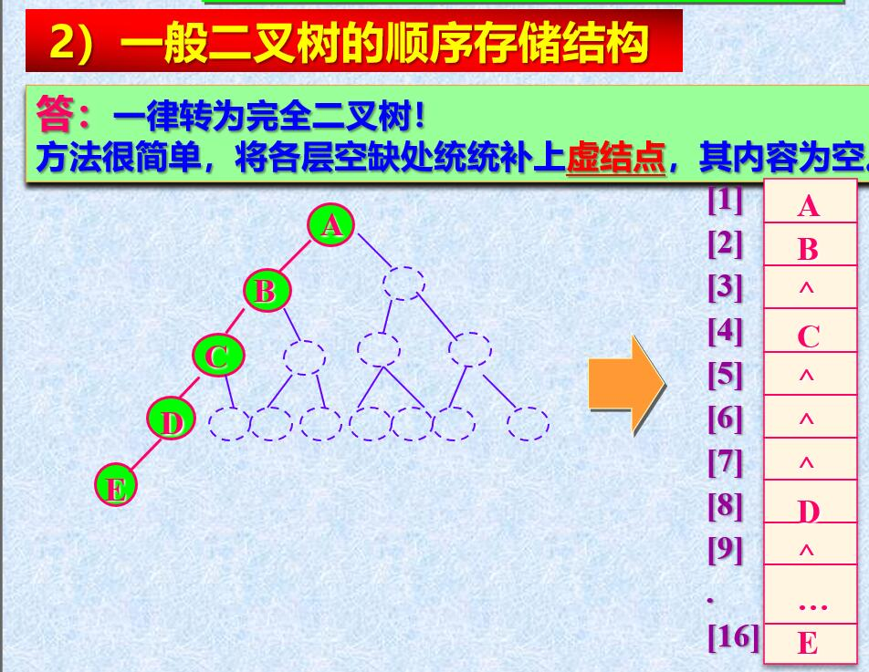

* 链式存储方式

  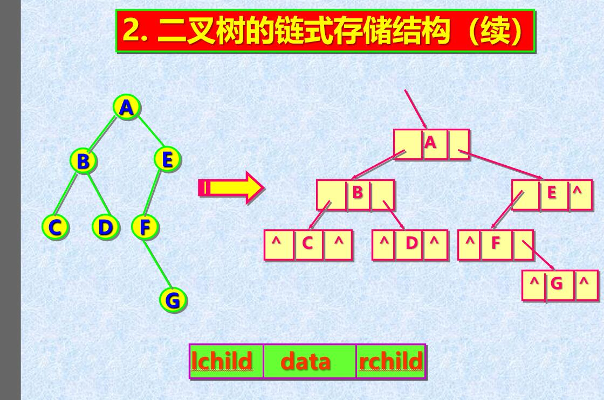

## 二叉树的链式表示

* 由于顺序存储方式劣势比较明显，平常用到的表示方式都是链式表示。

> 二叉树的存储结构

* 采用链式存储的方式，结点只存单个元素值，节点之间通过指针联系，维持集合的关系。

* 这里定义了左右孩子指针的bool标记变量，标记是否用来存放前驱和后继。

  ```c
  // 定义返回状态及返回码
  #define Status int
  #define OK 1
  #define ERROR 0
  // 定义存储的元素类型
  #define ElementType int
  
  // 二叉树结点结构定义
  typedef struct BinaryTreeNode
  {
  	// 数据域
  	BiTreeNodeElementType data;
  	// 指向左孩子的指针
  	BinaryTreeNode* left;
  	// 左指针功能标记，为true则指向前驱
  	bool ltag = false;
  	// 指向右孩子的指针
  	BinaryTreeNode* right;
  	// 右指针功能标记，为true则指向后继
  	bool rtag = false;
  }BTNode, *BinaryTree;
  ```

> 二叉树的常用操作

* 初始化

  * 拿到一个指向根结点的指针，即可确定一个二叉树

    ```c
    /* 01_二叉树——初始化*/
    Status initBiTree_T(BinaryTree& biTree)
    {
        biTree = NULL;
        return OK;
    }
    ```

* 销毁

  * 销毁一个二叉树结点是通过指向该结点的指针进行的。

    * 如果结点为空，则不需要进行操作

    * 如果结点不为空，则需要先删除左右孩子结点，再删除该结点

    ```c
    /* 02_二叉树——销毁*/
    Status destroyBiTree_T(BinaryTree& biTree)
    {
        // 如果结点不为空
        if (biTree)
        {
            biTree->parent = NULL;
            // 先删除左右子树
            if (destroyBiTree_T(biTree->left) && destroyBiTree_T(biTree->right))
            {
                return OK;
            }
            // 再删除该结点
            delete biTree;
        }
    	return OK;
    }
    ```
  
* 判空（是否为空树）

  * 即是判断根节点是否为空

    ```c
    /* 03_二叉树——判空*/
    Status emptyBiTree_T(BinaryTree biTree)
    {
        return biTree == NULL ? OK : ERROR;
    }
    ```

* 求深度

  * 利用树的递归，采用累加的方式求得。
  
  * 如果一个结点不为空，则该层的深度为1
  
  * 一个结点的深度，即是其左结点深度，与右节点的深度的较大者，加上本层的深度1。
  
    ```c
    /* 04_二叉树——深度*/
    int treeDepth_T(BinaryTree biTree)
    {
        // 该结点为空，则该层深度为0
        if (!biTree)
        {
            return 0;
        }
        // 否则，该层深度有1，要向上累加
        else
        {
            int leftDepth = treeDepth_T(biTree->left);
            int rightDepth = treeDepth_T(biTree->right);
            // 左右子树的深度，加上本层的深度1，即是该结点的深度
            return 1 + max(leftDepth, rightDepth);
        }
    }
    
    /*返回两个数较大的一个*/
    int max(int a, int b)
    {
        return a > b ? a : b;
    }
    ```
  
* 是否叶子结点

  * 左右孩子都不存在，即是叶子结点

    ```c
    /* 05_二叉树——是否是叶子结点*/
    Status leafBiNode_T(BinaryTree biTree)
    {
        // 左右孩子都不存在，即为叶子结点
        return (biTree->left == NULL && biTree->right == NULL) ? OK : ERROR;
    }
    ```

* 求父节点

  * 如果当前结点为空或，返回空。

  * 通过遍历左右子树找其父结点，若找到，则将父结点指针回溯。

    ```c
    /* 06_二叉树——求父结点*/
    BinaryTree parentBiNode_T(BinaryTree biTree, BinaryTree target)
    {
    	if (!biTree)
    	{
    		return NULL;
    	}
    	if (biTree->left == target || biTree->right == target)
    	{
    		return biTree;
    	}
    	// 若左子树未找到，则找右子树
    	BinaryTree parent = parentBiNode_T(biTree->left, target);
    	if (!parent)
    	{
    		parent = parentBiNode_T(biTree->right, target);
    	}
    	// 将结果回溯上去
    	return parent;
    }
    ```

* 深度优先遍历方式

  * 递归的前中后序遍历

    * 递归方式非常简单，注意好控制终止条件，按定义的遍历顺序即可。

    ```c
    /* 08_二叉树——先序遍历_递归*/
    void preOrderTraverse_Recur(BinaryTree biTree)
    {
    	if (!biTree)
    	{
    		return;
    	}
    	visit(biTree);
    	preOrderTraverse_Recur(biTree->left);
    	preOrderTraverse_Recur(biTree->right);
    }
    
    /* 09_二叉树——中序遍历_递归*/
    void inOrderTraverse_Recur(BinaryTree biTree)
    {
    	if (!biTree)
    	{
    		return;
    	}
    	inOrderTraverse_Recur(biTree->left);
    	visit(biTree);
    	inOrderTraverse_Recur(biTree->right);
    }
    
    /* 10_二叉树——后序遍历_递归*/
    void postOrderTraverse_Recur(BinaryTree biTree)
    {
    	if (!biTree)
    	{
    		return;
    	}
    	postOrderTraverse_Recur(biTree->left);
    	postOrderTraverse_Recur(biTree->right);
    	visit(biTree);
    }
    ```

  * 先序遍历_非递归（根 –> 左 --> 右）

    ```c
    /* 12_二叉树——先序遍历_非递归*/
    void preOrderTraverse_NonRecur(BinaryTree biTree)
    {
    	if (!biTree)
    	{
    		return;
    	}
    	// 采用栈存放当前结点的引用，用于左子树遍历完成，找到其右子树
    	SqStack nodeStack;
    	initStack_Sq(nodeStack);
    	BinaryTree popped = NULL;
    
    	// 外层：每一次循环完成一次左分支
    	while (!stackEmpty_Sq(nodeStack) || biTree)
    	{
    		
    		// 对左分支的迭代，是一个访问和压栈的过程
    		while (biTree)
    		{
    			// 先序遍历的关键，优先访问根结点
    			visit(biTree);
    			push_Sq(nodeStack, biTree);
    			// 对左结点的迭代
    			biTree = biTree->left;
    		}
    		// 一次左分支完成
    		if (!stackEmpty_Sq(nodeStack))
    		{
    			// 左分支结束，则将其父结点出栈
    			popped = (BinaryTree)malloc(sizeof(BinaryTreeNode));
    			pop_Sq(nodeStack, popped);
    			// 迭代到待访问的右孩子，下次循环执行访问
    			biTree = popped->right;
    		}
    	}
    	destroyStack_Sq(nodeStack);
    }
    ```

    * 按照先序遍历规则，遇到任意一个非空结点，即优先访问，所以过程为：
      * 访问它；
      * 将它压栈；
      * 迭代其左孩子；
    * 访问完成左孩子，
      * 将栈顶元素（以上的非空结点）出栈；
      * 通过该出栈元素继续迭代其右孩子。
    * 过程控制
      * 将非空的控制放到while循环条件中，所以循环体内不用考虑当前结点的左右孩子非空性质。
      * 入栈的结点是根结点。
      * 内层循环，一次循环表示一次赋值到其左孩子的过程。
      * 外层循环是控制遍历过程。一次循环代表一个结点的左子树的完成过程。以栈的非空性和当前结点的非空性共同决定是否还需继续遍历。

  * 中序遍历_非递归（左 --> 中 --> 右）

    ```c
    /* 13_二叉树——中序遍历_非递归*/
    void inOrderTraverse_NonRecur(BinaryTree biTree)
    {
    	if (!biTree)
    	{
    		return;
    	}
    	SqStack nodeStack;
    	initStack_Sq(nodeStack);
    	BinaryTree popped = NULL;
    
    	while (!stackEmpty_Sq(nodeStack) || biTree)
    	{
    		// 遇到左孩子即压栈
    		while (biTree)
    		{
    			push_Sq(nodeStack, biTree);
    			biTree = biTree->left;
    		}
    		if (!stackEmpty_Sq(nodeStack))
    		{
    			// 左孩子完毕，则栈顶为最后一个左孩子，进行输出
    			popped = (BinaryTree)malloc(sizeof(BinaryTreeNode));
    			pop_Sq(nodeStack, popped);
    			visit(popped);
    			// 继续迭代右子树的左孩子
    			biTree = popped->right;
    		}
    	}
    	destroyStack_Sq(nodeStack);
    }
    ```

    * 按照中序遍历规则，遇到任意非空结点，需要将左子树访问完成才能访问它，所以过程为：
      * 压栈；
      * 迭代其左孩子。
    * 左孩子迭代完成。
      * 栈顶元素为该非空结点，出栈，访问它；
      * 迭代到其右孩子，作为下一个非空结点的迭代。
    * 过程控制
      * 同先序遍历一样，非空的控制放到while循环体条件，循环体内不用考虑非空性。
      * 根据中序的规则，对结点的访问放到迭代完成其左子树之后。

  * 后序遍历 (左 --> 右 --> 中)

    ```c
    /* 14_二叉树——后序遍历_非递归*/
    void postOrderTraverse_NonRecur(BinaryTree biTree)
    {
    	if (!biTree)
    	{
    		return;
    	}
    	// 存任意非空结点的栈
    	SqStack nodeStack;
    	initStack_Sq(nodeStack);
    	push_Sq(nodeStack, biTree);
    	// 标记前一次访问的结点
    	BinaryTree pre = NULL;
    
    	while (!stackEmpty_Sq(nodeStack))
    	{
    		// 获取栈顶元素，不出栈，分两种情况讨论
    		getTop_Sq(nodeStack, biTree);
    		/**
    		 * 第一大类：
    		 * 1. 不存在左右结点；
    		 * 2. 前一次访问的结点不为空，且前一次访问的结点【等于当前结点的左孩子】或【右孩子】
    		 */
    		if ((!biTree->left && !biTree->right)
    			|| (pre != NULL
    				&& (pre == biTree->left || biTree == biTree->right)
    				))
    		{
    			visit(biTree);
    			BinaryTree bt = NULL;
    			pop_Sq(nodeStack, bt);
    			pre = biTree;
    		}
    		// 第二大类情况，有孩子未被访问，先右后左的优先级入栈其孩子
    		else
    		{
    			// 优先入栈右结点
    			if (biTree->right)
    			{
    				push_Sq(nodeStack, biTree->right);
    			}
    			if (biTree->left)
    			{
    				push_Sq(nodeStack, biTree->left);
    			}
    		}
    	}
    }
    ```

    * 规则：遇到任意一个结点，必须优先访问其左子树，其次访问右子树，最后再访问它本身。
    * 难题：对于左右子树的访问，都有访问完成回溯的情况：
      * 对于有左右子树的时候，左子树访问完成的回溯，当前结点不能出栈并访问；
      * 右子树访问完成，才能进行出栈和访问。
      * 需要区分回溯的情况，是从左子树回溯的，还是从右子树回溯的。
    * 情况划分：根据这种规则，将遇到一个非空结点的情况划分如下：
      * 无左右孩子 –> 可立即访问
      * 有孩子，但孩子都访问完成 –> 可立即访问
      * 有孩子未被访问。 –> 不可立即访问
    * 实现方案：
      * 全局设置一个指针，记录上一次被访问的结点。
      * 遇到一个结点
        * 可立即访问 –> 
          * 访问它；
          * 将栈顶出栈，赋值为上一次遍历的结点；
        * 不可立即访问 -> 按优先右子树，再左子树进行压栈，保证左子树的访问在右子树之前。

* 层次遍历（广度优先）

  ```c
  /* 15_二叉树——层次遍历*/
  void breadthTraverse(BinaryTree biTree)
  {
  	if (!biTree)
  	{
  		return;
  	}
  	// 存放子树根结点的队列
  	CircularQueue cq;
  	initQueue_Cq(cq);
  	enqueue_Cq(cq, biTree);
  	// 保存出队列的元素
  	BinaryTree deQueued = NULL;
  
  	while (!queueEmpty_Cq(cq))
  	{
  		// 任何结点都在出队列时候进行访问。
  		dequeue_Cq(cq, deQueued);
  		visit(deQueued);
  		if (deQueued->left)
  		{
  			enqueue_Cq(cq, deQueued->left);
  		}
  		if (deQueued->right)
  		{
  			enqueue_Cq(cq, deQueued->right);
  		}
  	}
  }
  ```

  * 首先将根结点入队列，作为迭代的开始。
  * 迭代的结点永远从**队列出队元素**开始。
  * 从队列中取出一个结点，访问它，并将它的孩子入队列。
  * 最终队列为空，层次遍历完毕。

* 是否完全二叉树判断

  ```c
  /* 30_二叉树——是否完全二叉树*/
  bool isCompleteBinary_T(BinaryTree biTree)
  {
  	// 用来标记【只有左孩子】或者【无孩子】
  	bool flag = false;
  	// 空树，直接返回是
  	if (!biTree)
  	{
  		return true;
  	}
  	// 保存当前判断结点
  	BinaryTree cur = NULL;
  	// 用循环队列保存下一层待访问结点
  	CQueue cq;
  	initQueue_Cq(cq);
  	enqueue_Cq(cq, biTree);
  	// 队列非空则表示还有结点未被访问
  	while (!queueEmpty_Cq(cq))
  	{
  		dequeue_Cq(cq, cur);
  		if (flag)
  		{
  			if ((!cur->rtag && cur->right) || (!cur->ltag && !cur->left))
  			{
  				return false;
  			}
  		}
  		else
  		{
  			// 左右结点都存在
  			if ((!cur->ltag && cur->left) && (!cur->rtag && cur->right))
  			{
  				enqueue_Cq(cq, cur->left);
  				enqueue_Cq(cq, cur->right);
  			}
  			// 只存在右结点，则非完全
  			else if (!cur->rtag && cur->right)
  			{
  				return false;
  			}
  			// 对【只有左孩子】，【无孩子】情况，做标记
  			else if (!cur->ltag && cur->left)
  			{
  				enqueue_Cq(cq, cur->left);
  				flag = true;
  			}
  			else
  			{
  				flag = true;
  			}
  		}
  	}
  	// 判断到最后都没有中间返回，则它是完全二叉树
  	return true;
  }
  ```

  * 首先，明确完全二叉树的定义，**除了最后一层**，其余每层都充满结点，最后一层的结点都**集中在左边**。
  * 完全二叉树按层来判断，则需要参考层次遍历的方式，采用**队列**数据结构，将当前访问到的结点的孩子加入队列。
  * 对是否最后一层的特殊判断，设置一个标记变量flag。
    
    * 若队列当前结点**只有左孩子或者没有孩子**，标记true。此后出现的结点按完全二叉树定义，应该都没有孩子，若出现了孩子，则不是完全二叉树。
  * 非最后一层。
    * 左右孩子都有，则直接入队。
    
    * 只有右孩子，则非完全，直接返回。
    
    * 只有左孩子，**按规则，达到最后一层**。
      * 左孩子入队；
      * 标记置为true；
      
    * 无孩子，也是最后一层，标记置为true。


* 叶子结点个数

  ```c
  /* 16_二叉树——叶子个数*/
  int leafCount_T(BinaryTree biTree)
  {
  	// 遇到空结点，则个数不变
  	if (!biTree)
  	{
  		return 0;
  	}
  	// 没有左右孩子，则它是叶子结点
  	else if (!biTree->left && !biTree->right)
  	{
  		return 1;
  	}
  	// 否则，求它的子树的叶子结点个数
  	else
  	{
  		return leafCount_T(biTree->left) + leafCount_T(biTree->right);
  	}
  }
  ```

  * 当前为空结点，则个数增加 0；
  * 当前非空，无左右孩子，则个数增加 1；
  * 当前非空，有孩子，则叶子个数为其左孩子叶子个数 + 右孩子叶子个数。

* 第 k 层的结点个数

  ```c
  /* 17_二叉树——第k层结点数目*/
  int getKLevel_T(BinaryTree biTree, int k)
  {
  	// 以根结点开始的第 k 层 => 以根结点的子孩子开始的第 k-1 层
  	if (!biTree)
  	{
  		return 0;
  	}
  	// 递归结束条件：1即为当前层级，以当前结点为开始的第一层，即当前根结点，只有1个
  	if (k == 1)
  	{
  		return 1;
  	}
  	return getKLevel_T(biTree->left, k - 1) + getKLevel_T(biTree->right, k - 1);
  }
  ```

  * 以**根结点**开始的第**k**层 => 以**根结点的孩子**开始的第 **k - 1**层。
  * 注意控制递归终止条件。

* 两个二叉树结构是否相同

  ```c
  /* 18_二叉树——结构是否相同*/
  bool structureCompare_T(BinaryTree bt1, BinaryTree bt2)
  {
  	/**
  	 * 总的思路是，遇到不同的即返回false，否则一直比较，比较完成返回true
  	 */
  	// 到最终两个一样为空
  	if (!bt1 && !bt2)
  	{
  		return true;
  	}
  	// 当一个为空，另一个不为空的时候
  	else if (
  		(!bt1 && bt2) || (!bt2 && bt1)
  		)
  	{
  		return false;
  	}
  	// 都不为空，则比较其孩子
  	bool same = structureCompare_T(bt1->left, bt2->left);
  	same = same && structureCompare_T(bt1->right, bt2->right);
  	return same;
  }
  ```

  * 等价于**比较结点有或没有**的情况。
  * 遇到一个有另一个没有的情况返回false。
  * 比较到最后都相同则返回true。

* 求一个二叉树的镜像

  ```c
  /* 19_二叉树——求镜像*/
  void treeMirror_T(BinaryTree biTree)
  {
  	// 左右孩子互换，从上到下
  	if (!biTree)
  	{
  		return;
  	}
  	// 先交换左右孩子根结点
  	BinaryTree temp = biTree->left;
  	biTree->left = biTree->right;
  	biTree->right = temp;
  	// 再对左右孩子分别进行互换
  	treeMirror_T(biTree->left);
  	treeMirror_T(biTree->right);
  }
  ```

* 求两个结点的最低公共祖先结点

  * 首先确定计算参数，在一个树中求两个结点的最低公共祖先结点。入参为**指向确定树的根结点的指针**和**指向两个结点的指针**。

  * 可能的情况有

    * **直系关系**。一个结点直接是另一个结点的直系祖先。
    * **旁系关系**。两个结点没有直接继承关系。

  * 算法描述。

    ```c
    /* 21_二叉树——找最低公共祖先*/
    BinaryTree findLCA_T(BinaryTree biTree, BinaryTree bt1, BinaryTree bt2)
    {
    	// 首先对当前根结点进行判断
    	// 如果当前根结点为空，或是等于两个待判断结点中的任意一个，则当前根结点即是最低公共祖先
    	if (!biTree)
    	{
    		// 这个空结果，影响下面递归的判断
    		return NULL;
    	}
    	if (biTree == bt1 || biTree == bt2)
    	{
    		return biTree;
    	}
    	// 否则分别在根结点的左右子树进行查找，两边都有一个结果，可能为空
    	BinaryTree left = findLCA_T(biTree->left, bt1, bt2);
    	BinaryTree right = findLCA_T(biTree->right, bt1, bt2);
    	// 分别在当前根结点结点两边
    	if (left && right)
    	{
    		return biTree;
    	}
    	// 在其中一边，取非空的一边
    	return left ? left : right;
    }
    ```

    * 运用递归的思想，即可以先求出两个结点对于当前根结点的左右子树的关系。
      * 两个结点对左子树和右子树**都有关系**。
        * 那么此时的根结点即是两个结点的最低公共祖先。
      * 两个结点都只与**左子树或右子树**有关系。
        * 那么即是求所在的子树和两个结点的关联关关系。

    * 递归终止条件控制
      * 当前根结点**为空**，则所求的最低公共祖先不存在，为空。
      * 当前根结点等于**结点中的一个**，那么当前结点即是所求的最低公共祖先结点。
  
* 二叉树任意两个结点的距离
  
    ```c
    /* 22_二叉树——结点距离*/
    int nodeDistance_T(BinaryTree biTree, BinaryTree bt1, BinaryTree bt2)
    {
    	// 先找到最低公共父结点
    	BinaryTree lca =  findLCA_T(biTree, bt1, bt2);
    
    	// 再求出LCA结点到两个结点距离，求和
    	int left = levelDist_T(lca, bt1);
    	int right = levelDist_T(lca, bt2);
    
    	return left + right;
    }
    
    /* 23_二叉树——结点相隔层数*/
    int levelDist_T(BinaryTree biTree, BinaryTree bt)
    {
    	// 用 -1 标识没找到
    	if (!biTree)
    	{
    		return -1;
    	}
    	// 找到了，当前层，层数不变
    	if (biTree == bt)
    	{
    		return 0;
    	}
    
    	// LCA结点和目标结点是直系关系。从LCA结点往下找
    	int levelDist = levelDist_T(biTree->left, bt);
    	// 若左子树没有找到，则找右子树
    	if (levelDist == -1)
    	{
    		levelDist = levelDist_T(biTree->right, bt);
    	}
    	// 找到了，则回溯
    	if (levelDist != -1)
    	{
    		return levelDist + 1;
    	}
        // 左右子树都没找到
    	return -1;
    }
    ```
    
    * 等价于**LCA结点**到两个结点的距离**（两个直系距离）之和**，其中每隔一个父子层级关系，距离为 1 。
    * LCA结点与目标结点的直系距离，则需要运用递归思想，从LCA结点向下找目标结点。
      * 迭代的结点是第一个参数（当前根结点）
      * 如果左子树找不到，则找右子树
      * 找到之后需要回溯，加上当前的层级距离为 1。
    
* 结点的所有祖先

    ```c
    /* 24_二叉树——结点所有祖先*/
    bool allAncestors_T(BinaryTree biTree, BinaryTree bt)
    {
    	// 利用求两个直系结点距离的思路
    	// 如果到最叶子结点都没有找到，则返回false，找到则返回true
    	if (!biTree)
    	{
    		return false;
    	}
    	if (biTree == bt)
    	{
    		return true;
    	}
    	// 从左右子树找
    	if (allAncestors_T(biTree->left, bt) || allAncestors_T(biTree->right, bt))
    	{
    		// 找到时候访问，并进行回溯
    		visit(biTree);
    		return true;
    	}
    	// 左右子树都每找到
    	return false;
    }
    ```

    * 可以参考两个结点的直系距离的思路。实际也是递归，从上往下找的过程。
    * 在**回溯的时候**对父结点进行**访问**，则回溯到根结点，所有的祖先已经被访问到了。
    
## 线索化二叉树

* 中序线索化及遍历

    * 中序线索化

        ```c
        /* 26_二叉树——中序线索化*/
        void inThreading_T(BinaryTree& bt, BinaryTree& pre)
        {
        	if (!bt)
        	{
        		return;
        	}
        	if (!bt->ltag)
        	{
        		inThreading_T(bt->left, pre);
        	}
        	
        	// 进行中序的线索化操作
        	// 遇到左孩子为空，即赋值为前置
        	if (!bt->left || bt->ltag)
        	{
        		bt->ltag = true;
        		bt->left = pre;
        	}
        	// 若前置结点非空，且没有右孩子
        	if (pre && (!pre->right || pre->rtag))
        	{
        		pre->rtag = true;
        		pre->right = bt;
        	}
        	// 当前结点 => 下一次迭代的前置结点
        	pre = bt;
        
    	if (!bt->rtag)
        	{
        		inThreading_T(bt->right, pre);
        	}
        }
        ```
    
        * 线索化利用了中序递归遍历的逻辑，将对结点的访问改为线索连接的过程。
        * 线索连接，在两个参数的基础上做递归：
        * 当前结点
            * 前一个被访问的结点
    * 线索连接过程要点
            * 仅对**非线索指针**进行线索化，否则造成死循环。
            * **当前连接前驱**。当前结点，左孩子为空，则置为前驱线索，指向前驱；
            * **前驱连接当前**。若前驱节点的右孩子为空，则将当前结点置为其前驱的后继（需判断第一个结点，前驱为空的情况）
            * **迭代pre变量**。线索连接完成，当前结点迭代为下一次访问的前驱。
            * 为了兼容**多次线索**或**多种线索**的过程。增加对**当前结点左标记**与**前驱结点右标记**的判断
    
    * 中序线索遍历
    
        ```c
        /* 29_二叉树——中序线索遍历*/
        void inThreadTraverse_T(BinaryTree biTree)
        {
        	if (!biTree)
        	{
        		return;
        	}
        	// 迭代的变量，保存当前及其上一次的结点
        	BinaryTree cur = biTree;
        	
        	// 结点为空则迭代结束（线索作用）
        	while (cur)
        	{
        		// 找到从根节点开始的左子树的叶子结点【中序第一个结点】
        		while (cur->left && !cur->ltag)
        		{
        			cur = cur->left;
        		}
        		visit(cur);
        		// 若结点没有右子树，只有后继，则直接输出它
        		while (cur->rtag)
        		{
        			visit(cur->right);
    			cur = cur->right;
        		}
        		// 有右子树，则按照中序遍历规则，必须先访问完成【右子树根结点的左子树 cur->right-> left】才能访问【右子树的根结点 cur->right】
        		// 迭代其右子树，重新进入上面的逻辑
        		cur = cur->right;
        	}
        }
        ```
    
        * 按照中序的规则，优先访问完成左子树。所以每遇到一个结点，先找到**左子树的最左叶子**。
        * 对于结点右孩子的访问情况
            * 节点的**右孩子**，在**遍历完成之前的迭代过程**都是**非空**的（线索的作用）
            * 区分结点**右孩子**作为**线索**和**子树**的区别。
                * **作为线索**，则该线索指向的结点的左子树是不能再被访问的（**当前结点**即是从**线索指向结点的左孩子**迭代下来的）
                * **作为子树**，则按中序规则，序优先迭代左子树，即回到主循环中。

* 前序线索化及遍历

  * 前序线索化

    ```c
    /* 25_二叉树——前序线索化*/
    void preThreading_T(BinaryTree& bt, BinaryTree& pre)
    {
    	if (!bt)
    	{
    		return;
    	}
    	// 进行前序线索化
    	if (!bt->left || bt->ltag)
    	{
    		bt->ltag = true;
    		bt->left = pre;
    	}
    	if (pre && (!pre->right || pre->rtag))
    	{
    		pre->rtag = true;
    		pre->right = bt;
    	}
    	pre = bt;
    
    	// 孩子不作为线索，才执行
    	if (!bt->ltag)
    	{
    		preThreading_T(bt->left, pre);
    	}
    	if (!bt->rtag)
    	{
    		preThreading_T(bt->right, pre);
    	}
    }
    ```

    * 利用前序递归遍历的逻辑，将访问过程改为线索化过程。
    * 主逻辑同中序线索化，同样方法兼容多种和多次线索的过程。
    * 只对**非线索指向的结点**进行线索化，避免死循环。

  * 前序线索遍历

    ```c
    /* 28_二叉树——前序线索遍历*/
    void preThreadTraverse_T(BinaryTree biTree)
    {
    	if (!biTree)
    	{
    		return;
    	}
    	// 迭代的变量
    	BinaryTree cur = biTree;
    
    	// 结点为空则代表结束
    	while (cur)
    	{
    		visit(cur);
    		// 优先访问当前结点
    		while (cur->left && !cur->ltag)
    		{
    			cur = cur->left;
    			visit(cur);
    		}
    		cur = cur->right;
    	}
    }
    ```

    * 按前序遍历的思路，优先访问根结点。
    * 顺着线索访问即可，不用关注右结点是子树还是线索。

* 后序线索化及遍历

  * 后序线索化逻辑同前序和中序一致。
  * 由于后序线索化对遍历的帮助不大，所以不再纠结于后序的线索遍历。

## 二叉搜索树

> 二叉搜索树定义

对于任意结点，其关键字不小于其左子树的最大关键字，不大于其右子树中的最小关键字。

示例：


* 二叉搜索树构建

  ```c
  /* 31_二叉树——构建二叉查找树*/
  Status binSerchAddElem_T(BinaryTree& cur, BiTreeNodeElementType elem)
  {
  	// 方法是向已有二叉搜索树中加入元素，若当前二叉树为空，则构建新的二叉树
  	// 结点为空时创建结点并设置值，从父节点迭代到左孩子或右孩子时执行
  	if (!cur)
  	{
  		cur = (BinaryTree)malloc(sizeof(BinaryTreeNode));
  		if (!cur)
  		{
  			printf("构建失败！");
  			return ERROR;
  		}
  		cur->data = elem;
  		cur->left = NULL;
  		cur->right = NULL;
  		cur->ltag = false;
  		cur->rtag = false;
  		return OK;
  	}
  	// 元素小于当前结点值，创建左结点
  	if (elem < cur->data)
  	{
  		if (!binSerchAddElem_T(cur->left, elem))
  		{
  			return ERROR;
  		}
  	}
  	// 元素大于等于当前结点值，创建右结点
  	else
  	{
  		if (!binSerchAddElem_T(cur->right, elem))
  		{
  			return ERROR;
  		}
  	}
  
  	return OK;
  }
  
  /* 32_二叉树——构建二叉查找树*/
  void buildBinarySearchTree(BinaryTree& bst, BiTreeNodeElementType* arr, int length)
  {
  	// 批量加元素即可
  	for (int i = 0; i < length; i++)
  	{
  		binSerchAddElem_T(bst, *(arr + i));
  	}
  }
  ```

  * 概念
    * 或为空树。
    * 左子树不空，左子树上所有结点值均小于根结点值；
    * 右子树不空，右子树上所有结点值均大于根结点值。
  * 构建过程。
    * 顺着二叉搜索树，逐一于当前结点进行比较；
      * 若小于当前结点的值，则与其左孩子根结点值比较；
      * 否则与右孩子根结点值比较。
    * 重复比较过程，直到当前结点为空。创建结点，将元素值赋值到新结点中。

* 二叉搜索树删除单个结点

  * 性质不变：删除某个结点后，仍然保持二叉搜索树的结构特性（**中序遍历为非递减序列**）。

  * 关键影响因素 => 在BST中**待删除结点的位置**。

  * 删除操作的关键：对不同位置结点的删除操作处理，如何**保证**删除后的**性质不变性**。

  * 根据对不同情况的处理（主要是**根据后继结点**的处理思路），分为以下几种情况（定义**待删除结点z**，其**左孩子left**， **右孩子right**，**中序后继结点Y**，**Y的右孩子为X**）

    * z无左子树，右子树可有可无（00, 01）

      

      * 直接将**右孩子替换Z的位置**

    * z有且仅有左孩子（10）

      

      * 直接将**左孩子替换Z的位置**

    * z有两个孩子（11），则需要先找到Z的中序后继结点Y

      * Z的右孩子根结点无左子树，则Y == Z->right
    
        
    
        * Y替换Z的位置，并且**左指针**指向Z的左孩子
      
      * Z的右孩子根结点有左子树，则后继Y在其左子树中。
      
        
      
        * 首先用**Y的右子树X**的位置替换Y的位置；
        * 用结点**Y的右指针指向right**；
        * Y的**左指针指向left**，并**替换Z的位置**。
    
  * 注意事项
  
    * 替换位置，即是需要找到其父结点指向该结点的指针，父结点可能通过**左指针或右指针**指向该结点；
    * 找Z的中序后继结点Y的操作，关键在于Z的**右子树根结点是否有左子树**。
  
  * 代码实现
  
    ```c
    /* 33_二叉树——二叉搜索树删除指定结点*/
    Status deleteBiSearchElem_T(BinaryTree& bst, BinaryTree& toDel)
    {
    	// 先找到其父结点
    	BinaryTree parent = parentBiNode_T(bst, toDel);
    	// 若父结点不存在，则当前即为根结点，直接删除结点并置空
    	if (!parent)
    	{
    		bst = NULL;
    		delete toDel;
    		toDel = NULL;
    		return OK;
    	}
    	// 四种情况
    	// 1. 待删除结点z无左孩子，用右孩子替换
    	if (!toDel->left)
    	{
    		// 当前结点与父节点的关系
    		if (parent->left == toDel) {
    			parent->left = toDel->right;
    		}
    		else
    		{
    			parent->right = toDel->right;
    		}
    		delete toDel;
    		toDel = NULL;
    		return OK;
    	}
    	// 2. 待删除结点z仅有左孩子
    	else if (toDel->left && !toDel->right)
    	{
    		if (parent->left == toDel)
    		{
    			parent->left = toDel->left;
    		}
    		else
    		{
    			parent->right = toDel->left;
    		}
    		return OK;
    	}
    	// 3. 待删除结点z有两个孩子
    	else
    	{
    		// 待删除结点的后继
    		BinaryTree post = inorderPost_T(bst, toDel);
    		// 无左孩子，右子树根结点即是后继
    		if (post == toDel->right)
    		{
    			// 左孩子先替换为待删除结点的左孩子
    			post->left = toDel->left;
    			// 将后继替换待删除
    			if (parent->left == toDel)
    			{
    				parent->left = post;
    			}
    			else
    			{
    				parent->right = post;
    			}
    		}
    		// 否则后继在其z->right的左子树中
    		else
    		{			
    			// 后继的父结点p
    			BinaryTree pParent = parentBiNode_T(bst, post);
    			if (pParent->left == post)
    			{
    				pParent->left = post->right;
    			}
    			else
    			{
    				pParent->right = post->right;
    			}
    			// 将后继替换待删除结点，并连接待删除的右子树
    			if (parent->left == toDel)
    			{
    				parent->left = post;
    			}
    			else
    			{
    				parent->right = post;
    			}
    			post->left = toDel->left;
    			post->right = toDel->right;
    			delete toDel;
    			toDel = NULL;
    		}
    		return OK;
    	}
    }
    
    /* 34_二叉树——查找二叉树中某个结点中序后继，找不到返回NULL*/
    BinaryTree inorderPost_T(BinaryTree bt, BinaryTree cur)
    {
    	if (!bt || !cur)
    	{
    		return NULL;
    	}
    
    	// 1. 有右子树，后继在其右子树中
    	BinaryTree post = cur->right;
    	if (post)
    	{
    		while (post->left)
    		{
    			post = post->left;
    		}
    		return post;
    	}
    	// 2. 无右子树
    	BinaryTree parent = NULL;
    	BinaryTree p = cur;
    	// 找到当前为父结点左孩子的结点
    	do
    	{
    		parent = parentBiNode_T(bt, p);
    		p = parent;
    	} while (parent && parent->left != p);
    	return parent;
    }
    ```

## 红黑树

> 红黑树定义

通过**变色**和**旋转**方式来实现存储过程中自平衡的**二叉搜索树**。保证最坏搜索情况下时间复杂度为 **O($log_2$ n)**。

> 红黑树的性质

1. 每个结点为**红色或黑色**；

2. 根结点为**黑色**；

3. 叶子结点（**NIL / NULL**）是黑色的；

4. **不可能有互为父子关系的两个红色结点**。

5. 对每个结点，从**该结点**到其所有**后代叶子结点**的简单路径上，均包含**相同数目的黑色结点**。

> 红黑树相关特性

* 一棵有**n个内部结点**的红黑树，高度**至多为 2 * $log_2$ (n - 1)**

> 结构定义

* 结点结构定义

  * **父指针**方便**自下而上**的查找。实现时候注意**父子关系**一致性。
  * **红黑状态**标记。注意**插入情况**下构建结点的颜色。

  ```c
  // 红黑树结点结构定义
  typedef struct BrTreeNode
  {
  	// 数据域
  	BrTreeNodeElementType data;
  	// 左孩子的指针
  	BrTreeNode* left;
  	// 右孩子的指针
  	BrTreeNode* right;
  	// 父指针
  	BrTreeNode* parent;
  	// 红黑状态标记，默认为红色
  	bool black = false;
  }BrNode, * BrTree;
  ```

* 常量定义

  ```c
  /*替代所有NULL的结点*/
  BrTreeNode nil = {NULL, NULL, NULL, NULL, true};
  
  /*根结点指针*/
  BrTree root = &nil;
  ```

  * nil ==> 红黑树中**所有Null指向**的替换
    * **未满状态**的结点（包括叶子）
    * **根结点的parent**
  * 根结点 => 所有**存取操作**的**初始**操作元素

> 红黑树的基本操作

* **变色**：红色和黑色之间的转变，在某些插入或删除条件的发生。

* 左旋：实现自平衡的一种方法。对某个**结点x**，**x的父结点**，**x右子树根y**，y**的左子树根β**之间的操作（当前操作对象为x）。
  
  ```c
  /* 02_红黑树_左旋（对某个结点及其右孩子的操作）*/
  void leftRotate_BrT(BrTree& root, BrTree x)
{
  	// 1. 保存其右孩子
  	BrTree y = x->right;
  
  	// 2. x -> y 连接更改，改为y的左孩子
  	x->right = y->left;
  	if (y->left != &nil)
  	{
  		y->left->parent = x;
  	}
  
  	// 3. x与其父结点关系
  	// 无父结点，x即为root
  	if (x->parent == &nil)
  	{
  		root = y;
  		y->parent = &nil;
  	}
  	// 为其左孩子
  	else if (x == x->parent->left)
  	{
  		x->parent->left = y;
  		y->parent = x->parent;
  	}
  	// 为其右孩子
  	else
  	{
  		x->parent->right = y;
  		y->parent = x->parent;
  	}
  	
  	// 4. 调整为 y -> x 的关系，反向
  	y->left = x;
  	x->parent = y;
  }
  ```
  
  * 找到**x的右孩子**，用**指针y保存**；
  * x **断开与 y**的连接，改为**连接y的左孩子**（存在互相指向，注意**父指针别遗忘**）；
  * 指向x的结点，改为指向y（互相指向，**别遗忘父指针**）；
  * 建立新的x与y之间指向（**别遗忘父指针**）。
  
* 右旋：参考左旋，操作与之对称，**与左旋互为逆过程**。对某个结点y，y的父结点，y的左子树根x，x的右子树根β之间的操作。

  ```c
  /* 03_红黑树_右旋（对某个结点及其左孩子的操作）*/
  void rightRotate_BrT(BrTree& root, BrTree y)
  {
  	// 1. 保存其左孩子
  	BrTree x = y->left;
  
  	// 2. y -> x的连接更改，改为x的右孩子
  	y->left = x->right;
  	if (x->right != &nil)
  	{
  		x->right->parent = y;
  	}
  
  	// 3. y与上级指针的关系
  	// 无父指针，则y为根结点
  	if (y->parent == &nil)
  	{
  		root = x;
  		x->parent = &nil;
  	}
  	// y为父的左
  	else if (y == y->parent->left)
  	{
  		y->parent->left = x;
  		x->parent = y->parent;
  	}
  	// y为父的右
  	else
  	{
  		y->parent->right = x;
  		x->parent = y->parent;
  	}
  	
  	// 4. 调整为 x -> y 的关系，反向
  	x->right = y;
  	y->parent = x;
  }
  ```
  
  

### 红黑树的**插入元素**操作 

* 先按二叉查找树（BST）方式**插入**元素。
  
  ```c
  /* 04_红黑树_插入元素（插入完成，根据情况执行保持平衡的基本操作）*/
  Status insertElem_BrT(BrTree& root, BrTreeNodeElementType data)
  {
  	// 1. 根结点为空，直接插入，并返回
  	if (root == &nil)
  	{
  		return buildBrNode_BrT(root, true, data) ? OK : ERROR;
  	}
  	// 2. 否则构建红色结点，并执行二叉搜索插入
  	BrTree toAdd = NULL;
  	if (!buildBrNode_BrT(toAdd, false, data))
  	{
  		return ERROR;
  	}
  	brSearchAddElem(root, toAdd);
  	// 3. 判断红黑特性，决定自平衡操作
  	insertFixUp_BrT(root, toAdd);
  	return OK;
  }
  ```
  
  * 先**判断根结点**是否为Null。
    
    ```c
    /* 根据颜色和数据，构建结点*/
    Status buildBrNode_BrT(BrTree& brT, bool black, BrTreeNodeElementType data)
    {
    	brT = (BrTree)malloc(sizeof(BrTreeNode));
    	if (!brT)
    	{
    		printf("构建结点失败！\n");
    		return ERROR;
    	}
    	// 颜色、数据
    	brT->black = black;
    	brT->data = data;
    	// 处理Null
    	brT->left = &nil;
    	brT->right = &nil;
    	brT->parent = &nil;
    
    	return OK;
    }
    ```
    
    * 是。
      * 插入即是树根，构建**黑色**结点。
      * 处理Null位置，退出。
    * 否。构建红色结点。
    
  * 执行二叉搜索插入。
  
    ```c
    /* 红黑树基础二叉搜索插入(注意parent指针)*/ 
    void brSearchAddElem(BrTree& brT, BrTree& toAdd)
    {
    	// 关键字大小，小于 ==> 左子树
    	if (toAdd->data < brT->data)
    	{
    		// 为空，连接上，设置父子关系
    		if (brT->left == &nil)
    		{
    			brT->left = toAdd;
    			toAdd->parent = brT;
    			return;
    		}
    		// 递归其左子树
    		else
    		{
    			brSearchAddElem(brT->left, toAdd);
    		}
    	}
    	// 大于等于 ==> 右子树
    	else
    	{
    		if (brT->right == &nil)
    		{
    			brT->right = toAdd;
    			toAdd->parent = brT;
    			return;
    		}
    		// 递归其右子树
    		else
    		{
    			brSearchAddElem(brT->right, toAdd);
    		}
    	}
    }
    ```
  
* **检查**红黑特性满足条件，**决策**执行自平衡操作。
  
  * 父亲为黑色，不影响平衡，不操作。
  * 父亲为红色 ==> 一定有**黑色的祖父**结点。
    * 叔叔为红色。
      
      
      
      1. **父亲和叔叔**变**黑色**；
      2. **爷爷**变**红色**；
      3. **当前**结点置为**爷爷**，继续检查。
      
    * 叔叔为黑色（包括Null）
      
      * 祖父、父亲、孩子**同向**（同左边或同右边）
        1. 祖父、父亲变色；
        2. 祖父旋转（同左 ==> 右转，同右 ==> 左转）
      * 祖父、父亲、孩子**不同向**
        1. 对父亲旋转，使得三代同向。
        
        2. **按同向逻辑**变色和旋转。
        
           
  
* 红黑树插入自平衡代码

  ```c
  /* 10_红黑树_插入自平衡处理*/
  void insertFixUp_BrT(BrTree& root, BrTree cur)
  {
  	// 父亲红色时候，才需要进行平衡
  	while (!cur->parent->black)
  	{
  		// 叔叔结点
  		BrTree uncle;
  		// 父亲是祖父左孩子
  		if (cur->parent == cur->parent->parent->left)
  		{
  			// 叔叔（祖父右孩子）
  			uncle = cur->parent->parent->right;
  			// 1. 父代均为红色，仅变色
  			if (!uncle->black)
  			{
  				cur->parent->black = true;
  				uncle->black = true;
  				cur->parent->parent->black = false;
  				cur = cur->parent->parent;
  				// 为红色需重新进入判断
  				continue;
  			}
  			// 2. 叔叔黑，父亲红
  			// 2.1 当前为父亲的右孩子
  			else if (cur == cur->parent->right)
  			{
  				cur = cur->parent;
  				leftRotate_BrT(root, cur);
  			}
  			// 2.2 当前为父亲左孩子
  			cur->parent->black = true;
  			cur->parent->parent->black = false;
  			rightRotate_BrT(root, cur->parent->parent);
  		}
  		// 父亲是祖父右孩子
  		else
  		{
  			// 叔叔（祖父左孩子）
  			uncle = cur->parent->parent->left;
  			// 1. 父代均为红色，仅变色
  			if (!uncle->black)
  			{
  				cur->parent->black = true;
  				uncle->black = true;
  				cur->parent->parent->black = false;
  				cur = cur->parent->parent;
  				continue;
  			}
  			// 2. 叔叔黑，父亲红
  			// 2.1 当前为父亲的左孩子
  			else if (cur == cur->parent->left)
  			{
  				cur = cur->parent;
  				rightRotate_BrT(root, cur);
  			}
  			// 2.2 当前为父亲右孩子
  			cur->parent->black = true;
  			cur->parent->parent->black = false;
  			leftRotate_BrT(root, cur->parent->parent);
  		}
  	}
  	root->black = true;
  }
  ```

### 红黑树的**删除元素**操作

> 先按二叉查找树（BST）方式**删除**元素（参考**BST删除元素**）。
>
> 结点定义
>
> * Z ==> 待删除结点
> * X ==> 自平衡起始的结点（**替代结点**）
> * Y ==> 按**z的孩子数**
>   * **为2**时候：y作为z的**后继**
>   * **小于2**个，y用于保存**z的颜色**

  * 元素**没有左孩子**，用右其孩子替换（不论右孩子是否为空）。
  
  * **没有右孩子**，用其左孩子替换（不论左孩子是否为空）。
  
    
  
  * 有**两个孩子**。需要找其**前驱或后继**（这里找其**后继**）。
    
    * 右孩子无左子树，则后继==> 右孩子。
    
    * 右孩子有左子树，后继 ==> 左子树最左的元素。
    
      
> **检查**红黑特性满足条件，**决策**执行自平衡操作。
>
> 1. 自平衡情况是左右对称的，**只需讨论一边的情况，另一边镜像即可**。
> 2. 总体思路：先讨论替代节点的红黑情况，再讨论

* 自平衡的结点定义

  

* 删除自平衡操作。

  1. 替代结点X 为红色 ==> 变黑即可

     

     * 根据红黑性质【**不能有两个连续的红色结点**】，推导出【真正**删除的结点为黑色**】，而父亲的颜色不确定
     * 当前①②所在分支**少了一个黑结点**，黑平衡被破坏，将当前**红结点变黑即可解决**。

  2. 替代结点X为黑色 

     1. 兄弟S为红色 ==> **父亲P，左侄子SL，右侄子SR一定为黑色**

        

        * 兄弟S，父亲P互换颜色；
        * 对P旋转，更新旋转后的**兄弟指针指向**（图中的SL）。
        * 此时所有路径**黑结点数未受影响**。经过路径①②的黑结点，仍然比其他路径少1个。但情况以转变为如下【兄弟S为黑色】

     2. 兄弟S为黑色
     
        1. 兄弟的左右孩子（SL和SR）均为黑色
     
           
     
           1. 父亲P为黑色
           2. 父亲P为红色
     
        2. 兄弟的孩子（SL与SR）中存在红色，父亲（P）均可。
     
           
     
           1. 左孩子SL为红色，SR为黑色。
           2. SR为红色，SL可红可黑。